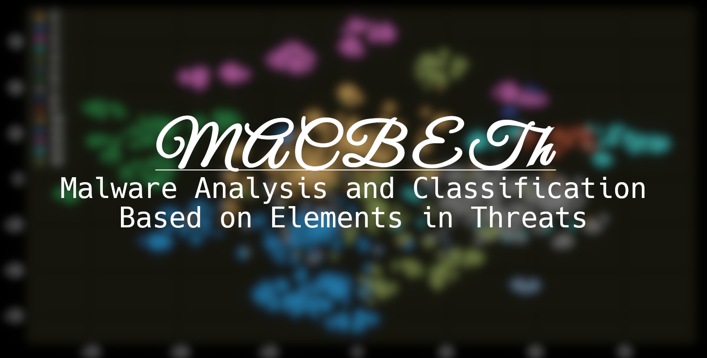
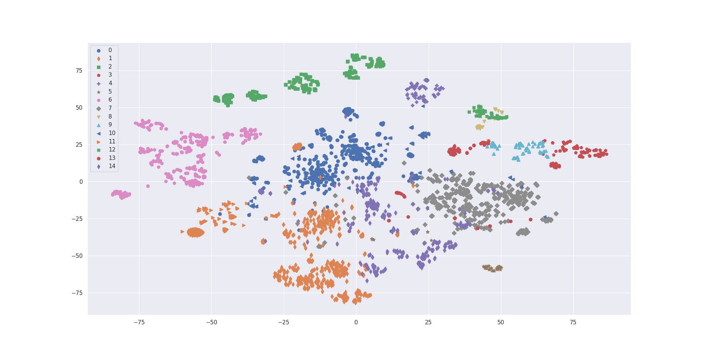

Analyses malware based on its attributes, and helps classify malware based on reports generated in VirusTotal.

## Features

MACBETh has two main parts, [clustering](#clustering) and [classification](#classification).

### Clustering


MACBETh can perform unsupervised clustering of malware samples. By default, it uses Principal Component Analysis (PCA) to reduce the dimensionality of the data and the K-means algorithm to generate the clusters, but other algorithms are available in the [CLI](#installation-and-usage).

### Classification

MACBETh also allows for the classification of malware samples. Simply provide it with a VirusTotal report and it will predict what malware family it belongs to.

## Installation and Usage

To install MACBETh, simply download this repository, create a new virtual environment, and install the required dependencies using

```bash
pip install -r requirements.txt
```

Download some VirusTotal reports using the included scraper in the `scraper` directory.

The main command is

```bash
python main.py
```

and appropriate help text will appear.

## (Re)training the Classifier

To retrain the classifier, a few things need to be present.

- Some VirusTotal reports must be present in `data/json`.
- The VirusTotal reports must be preprocessed by running the `prepare_data.py` script.

Once done, you can run the Jupyter notebooks in the `classification` directory. This will retrain the models.

## License

This repository is licensed under the MIT license. The license text can be found in [`LICENSE`](LICENSE).
